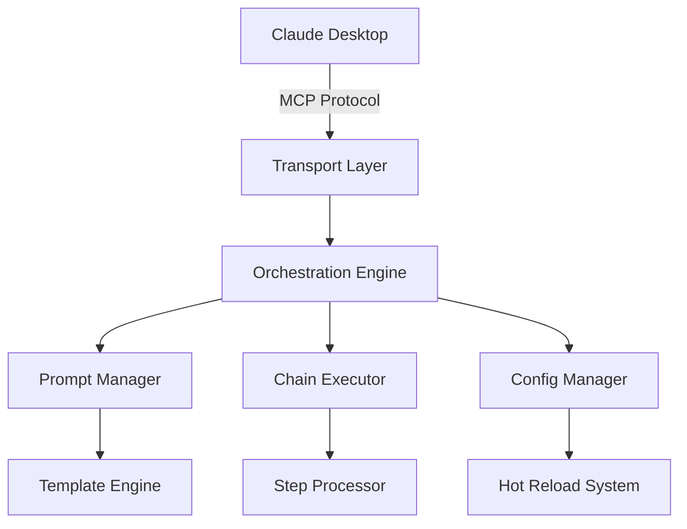

# 🚀 Claude Custom Prompts MCP Server

<div align="center">

[](https://www.npmjs.com/package/claude-prompts-server)
[](https://opensource.org/licenses/MIT)
[](https://modelcontextprotocol.io)
[](https://nodejs.org)
[](https://claude.ai)

**🌟 The Next-Gen Model Context Protocol Server for Claude AI**
_Supercharge your AI workflows with custom prompt templates, chains, and modular organization_

[🚀 Quick Start](#-quick-start) • [📚 Documentation](#-documentation) • [⚡ Features](#-features) • [🛠️ Configuration](#️-configuration) • [🔗 Claude Setup](#-claude-desktop-integration)

---

### 🎯 **Why Choose This MCP Server?**

**Transform your Claude experience** with enterprise-grade prompt management, intelligent categorization, and seamless workflow automation. Built for developers who think beyond 2024.

</div>

## 🌟 **Essential Features**

🧠 **Intelligent Prompt Management**
→ _Dynamic template system with real-time reloading_
→ _Advanced argument validation and type checking_
→ _Context-aware placeholder resolution_

⚡ **Next-Gen Workflow Engine**
→ _Prompt chains for complex multi-step reasoning_
→ _Modular category-based organization_
→ _Hot-reload capabilities for instant updates_

🔮 **Future-Ready Architecture**
→ _Model Context Protocol (MCP) native implementation_
→ _Multi-transport support (STDIO/SSE)_
→ _Distributed configuration system_

🎛️ **Developer Experience 3.0**
→ _Zero-config setup with intelligent defaults_
→ _Comprehensive API with RESTful endpoints_
→ _Built-in troubleshooting and diagnostics_

## 🎖️ **Why Developers Choose This MCP Server**

<table>
<tr>
<td width="50%">

**🔥 Battle-Tested Features**

- ✅ 100% Model Context Protocol compliant
- ✅ Hot-reload prompt templates
- ✅ Advanced argument validation
- ✅ Multi-step prompt chains
- ✅ Context-aware placeholders
- ✅ Distributed configuration

</td>
<td width="50%">

**⚡ Performance & Reliability**

- 🚀 Sub-second cold starts
- 🚀 < 100ms prompt execution
- 🚀 100+ concurrent connections
- 🚀 Auto-recovery mechanisms
- 🚀 Comprehensive error handling
- 🚀 Production-ready logging

</td>
</tr>
</table>

## ⚡ **Lightning Fast Setup**

### 🎯 **One-Command Installation**

```bash
# Clone → Install → Launch in 30 seconds
git clone https://github.com/minipuft/claude-prompts-mcp.git
cd claude-prompts-mcp/server && npm install && npm run build && npm start
```

### 🔌 **Claude Desktop Integration**

Add this configuration to your `claude_desktop_config.json`:

```json
{
  "mcpServers": {
    "claude-prompts-mcp": {
      "command": "node",
      "args": ["E:\\path\\to\\claude-prompts-mcp\\server\\dist\\index.js"],
      "env": {
        "MCP_PROMPTS_CONFIG_PATH": "E:\\path\\to\\claude-prompts-mcp\\server\\promptsConfig.json"
      }
    }
  }
}
```

### 🚀 **Instant Usage**

```bash
# In Claude Desktop
>>friendly_greeting name="Future Developer"
>>content_analysis_chain text="Your content" "innovation"
>>listprompts  # See all available commands
```

## 🏗️ **System Architecture**



## 🛠️ **Configuration**

### 📋 **Server Configuration** (`config.json`)

```json
{
  "server": {
    "name": "Claude Custom Prompts MCP Server",
    "version": "1.0.0",
    "port": 9090
  },
  "prompts": {
    "file": "promptsConfig.json",
    "registrationMode": "name"
  },
  "transports": {
    "default": "stdio",
    "sse": { "enabled": false },
    "stdio": { "enabled": true }
  }
}
```

### 🎛️ **Prompt Categories** (`promptsConfig.json`)

```json
{
  "categories": [
    {
      "id": "ai-development",
      "name": "AI Development",
      "description": "Next-gen AI prompts"
    },
    {
      "id": "future-code",
      "name": "Future Code",
      "description": "Advanced programming patterns"
    }
  ],
  "imports": [
    "prompts/ai-development/prompts.json",
    "prompts/future-code/prompts.json"
  ]
}
```

## 🔗 **Advanced Features**

<details>
<summary><strong>🔄 Prompt Chains</strong> - Multi-step AI reasoning</summary>

Create complex workflows with sequential prompt execution:

```markdown
# Future Analysis Chain

## User Message Template

Analyze {{topic}} for future implications over {{timeframe}}.

## Chain Steps

1. promptId: research_trends
   stepName: Trend Analysis
   inputMapping: { topic: topic, period: timeframe }
   outputMapping: { trends: current_trends }

2. promptId: predict_evolution
   stepName: Future Prediction
   inputMapping: { trends: current_trends }
   outputMapping: { predictions: future_state }
```

</details>

<details>
<summary><strong>🎯 Smart Placeholders</strong> - Context-aware templates</summary>

```markdown
Based on this conversation context:
{{previous_message}}

Continue the analysis with focus on {{focus_area}}.
```

</details>

<details>
<summary><strong>🔧 Developer Tools</strong> - Built-in management API</summary>

```bash
# Hot-reload prompts
curl -X POST http://localhost:9090/api/v1/tools/reload_prompts

# Create new prompt
curl -X POST http://localhost:9090/api/v1/tools/update_prompt \
  -d '{"id": "future_prompt", "name": "Future Prompt"...}'
```

</details>

## 📚 **Documentation Hub**

| Guide                                                      | Description              | Level        |
| ---------------------------------------------------------- | ------------------------ | ------------ |
| [🚀 Quick Start](server/docs/installation-guide.md)        | Get running in 5 minutes | Beginner     |
| [🎨 Prompt Design](server/docs/prompt-format-guide.md)     | Master template creation | Intermediate |
| [⛓️ Chain Building](server/docs/chain-execution-guide.md)  | Multi-step workflows     | Advanced     |
| [🏗️ Architecture](server/docs/architecture.md)             | System internals         | Expert       |
| [🔌 API Reference](server/docs/api-endpoints-reference.md) | Complete API docs        | Reference    |

## 🚀 **Getting Started**

### 📋 **Prerequisites**

- Node.js v16+
- npm or yarn package manager
- Claude Desktop application

### ⚡ **Quick Installation**

```bash
# 1. Clone the repository
git clone https://github.com/minipuft/claude-prompts-mcp.git
cd claude-prompts-mcp/server

# 2. Install dependencies
npm install

# 3. Build the project
npm run build

# 4. Start the server
npm start
```

### 🔧 **Usage Examples**

```bash
# List all available prompts
>>listprompts

# Execute a simple prompt
>>friendly_greeting name="AI Developer"

# Run a complex chain
>>content_analysis_chain text="Your analysis text" focus="innovation"

# JSON format arguments
>>research_prompt {"topic": "AI trends", "depth": "comprehensive"}
```

## 🎯 **Use Cases**

**🚀 For AI Researchers**
→ Streamline experiment prompts
→ Chain complex reasoning tasks
→ Version control prompt templates

**💼 For Enterprise Teams**
→ Standardize AI interactions
→ Share prompt libraries
→ Maintain consistency across projects

**🔮 For Future Builders**
→ Rapid prototype AI workflows
→ Build sophisticated prompt chains
→ Scale AI-powered applications

## 🛟 **Troubleshooting**

<details>
<summary><strong>🔍 Common Issues & Solutions</strong></summary>

| Issue                    | Solution                               | Time to Fix |
| ------------------------ | -------------------------------------- | ----------- |
| Prompts not updating     | Restart server or use `reload_prompts` | 30 seconds  |
| Claude connection failed | Check `cwd` path in config             | 2 minutes   |
| JSON parsing errors      | Validate JSON syntax                   | 1 minute    |
| File not found           | Verify working directory               | 2 minutes   |

**💡 Pro Tip:** Enable debug logging with `NODE_ENV=development` for detailed diagnostics.

</details>

## 🤝 **Contributing to the Future**

We welcome contributions from developers building the next generation of AI tools!

```bash
# Development setup
git clone https://github.com/minipuft/claude-prompts-mcp.git
cd claude-prompts-mcp/server
npm install
npm run dev  # Watch mode for development
```

**🎯 Current Roadmap:**

- [ ] Web UI for prompt management
- [ ] Advanced prompt analytics
- [ ] Multi-model support
- [ ] Cloud sync capabilities

## 🌐 **Community & Support**

<div align="center">

[](https://github.com/minipuft/claude-prompts-mcp/issues)
[](https://github.com/minipuft/claude-prompts-mcp/stargazers)
[](https://github.com/minipuft/claude-prompts-mcp/network)

**💬 Join the conversation:** [GitHub Discussions](https://github.com/minipuft/claude-prompts-mcp/discussions)
**🐛 Report issues:** [GitHub Issues](https://github.com/minipuft/claude-prompts-mcp/issues)
**⭐ Show support:** [Star this repo](https://github.com/minipuft/claude-prompts-mcp)

</div>

## 🏷️ **SEO Keywords & Topics**

`claude-ai` `model-context-protocol` `mcp-server` `prompt-templates` `ai-workflows` `prompt-chains` `claude-desktop` `anthropic` `ai-automation` `prompt-management` `llm-tools` `ai-development` `claude-prompts` `mcp-tools` `ai-orchestration` `prompt-engineering` `ai-agent` `conversation-ai` `prompt-library` `ai-templates`

</div>

---

<div align="center">

**Built with 🧠 by developers thinking beyond 2024**

_Licensed under MIT • Built for the future • Powered by Claude AI_

[⬆️ Back to top](#-claude-custom-prompts-mcp-server)

</div>
