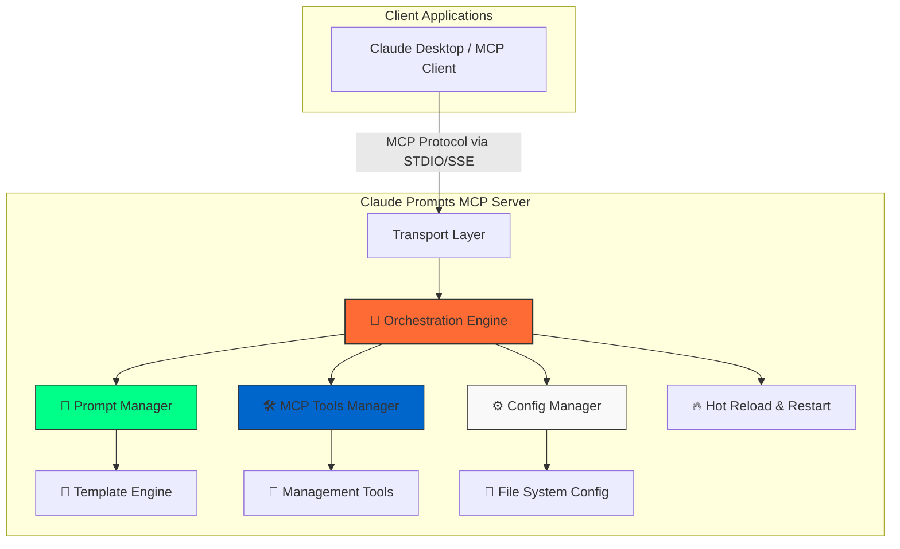

# Architecture Overview

This document provides a high-level overview of the Claude Prompts MCP Server, explaining its component-based architecture and how different modules collaborate to deliver a robust and extensible system.

## Core Principles

The server is designed around several key principles:

- **Modularity**: The system is divided into distinct, independent modules, each with a specific responsibility. This separation of concerns simplifies development, testing, and maintenance.
- **Orchestration**: A central orchestrator manages the application lifecycle, ensuring modules are initialized in the correct order and dependencies are handled gracefully.
- **Configuration-Driven**: Server behavior, prompt locations, and features are controlled through external configuration files, allowing for easy customization without code changes.
- **Hot-Reload**: The server can reload prompts, configurations, and templates on-the-fly without requiring a full restart, enabling rapid development and iteration.
- **Extensibility**: The modular design makes it straightforward to add new features, transports, or tools.

## System Architecture

The server's architecture is centered around the **Orchestration Engine**, which coordinates all other modules. Client applications, like Claude Desktop, interact with the server using the Model Context Protocol (MCP).

## Orchestration Engine (`ApplicationOrchestrator`)

The `ApplicationOrchestrator` is the heart of the server. It manages the entire application lifecycle through a deterministic, multi-phase startup sequence.

### Startup Phases

1.  **Phase 1: Foundation Initialization**

    - Detects the server's root directory.
    - Initializes the `ConfigManager` and loads `config.json`.
    - Determines the transport protocol (STDIO or SSE).
    - Sets up the `Logger`.
    - Initializes foundational services like `TextReferenceManager` and `ConversationManager`.

2.  **Phase 2: Data Loading and Processing**

    - Initializes the `PromptManager`.
    - Locates and loads the main `promptsConfig.json`.
    - Recursively imports, loads, and converts all prompt files into a standardized MCP format.
    - Handles path resolution to work reliably in different environments (e.g., local dev vs. Claude Desktop).

3.  **Phase 3: Module Initialization**

    - Initializes the `PromptExecutor` with the loaded prompts.
    - Initializes the `McpToolsManager` and passes it references to other modules.
    - Registers all MCP tools (e.g., `execute_prompt`, `update_prompt`).
    - Registers all loaded prompts with the MCP Server instance.

4.  **Phase 4: Server Startup**
    - Initializes the `TransportManager` to handle communication (STDIO or SSE).
    - If SSE is enabled, starts the `ApiManager` to handle HTTP requests.
    - Starts the main server, making it ready to accept client connections.

### Key Orchestration Features

- **Hot-Reload**: The `fullServerRefresh()` method can be triggered to re-run the data loading phase (Phase 2), reloading all prompts and propagating the changes to all modules without downtime.
- **Server Restart**: The `restartServer()` method provides a clean shutdown and process exit, allowing a process manager (like PM2) to restart it gracefully.
- **Health & Diagnostics**: The orchestrator exposes methods (`validateHealth`, `getPerformanceMetrics`) to provide detailed, real-time insights into the server's status.

## Component Deep Dive

### `PromptManager`

- **Responsibilities**: The single source of truth for loading, parsing, validating, and converting prompts. It manages the entire prompt lifecycle from file to MCP-compatible object.
- **Dependencies**: Uses `ConfigManager` to find prompt files and `TextReferenceManager` to resolve `{{ref:..}}` tags.
- **Key Feature**: Utilizes a powerful **Nunjucks-based template engine** to process dynamic placeholders, conditionals, and loops within prompts.

### `McpToolsManager`

- **Responsibilities**: Registers and implements all the interactive capabilities of the server exposed as MCP tools.
- **Interaction Model**: This is the primary way users and clients interact with the server. Instead of a traditional REST API for prompts, clients invoke tools like `execute_prompt`.
- **Key Tools**:
  - `execute_prompt`: The main entry point for running prompts with intelligent execution mode detection (e.g., `>>content_analysis ...`).
  - `listprompts`: Discovers available commands.
  - `update_prompt`, `delete_prompt`, etc.: A suite of tools for dynamically managing prompts.

### `TransportManager` & `ApiManager`

- **Responsibilities**: Abstract the communication layer.
- `TransportManager` handles the low-level MCP communication over different transports, currently **STDIO** (for clients like Claude Desktop) and **SSE** (for web-based clients).
- The `ApiManager` is created only when the SSE transport is active and is responsible for setting up the necessary HTTP routes.

### `ConfigManager`

- **Responsibilities**: Manages loading and accessing the server's configuration from `config.json`. It provides reliable paths to other configuration files, like `promptsConfig.json`.

### Storage

The system uses a flexible, file-based storage model:

- `config.json`: The central server configuration file.
- `promptsConfig.json`: Defines the category structure and lists the prompt files to import. This allows prompts to be organized into a modular and hierarchical folder structure (e.g., `prompts/development/`, `prompts/analysis/`).

## Data Flow: Prompt Execution

1.  A user in an MCP client types a command (e.g., `>>friendly_greeting name="Dev"`).
2.  The client sends a `tool_code` request to the server for the `execute_prompt` tool with the command string as an argument.
3.  The `TransportManager` receives the request and passes it to the `McpToolsManager`.
4.  `McpToolsManager` parses the command, identifies the prompt ID (`friendly_greeting`), and extracts the arguments (`{name: "Dev"}`).
5.  It invokes the `PromptManager`'s templating engine, which injects the arguments into the prompt's user message template.
6.  The final, processed text is returned to the client as the tool's result.

## Technology Stack

- **Runtime**: Node.js
- **Language**: TypeScript
- **Schema Validation**: Zod
- **Template Engine**: Nunjucks
- **Logging**: Winston
- **Core Protocol**: `@modelcontextprotocol/sdk`
