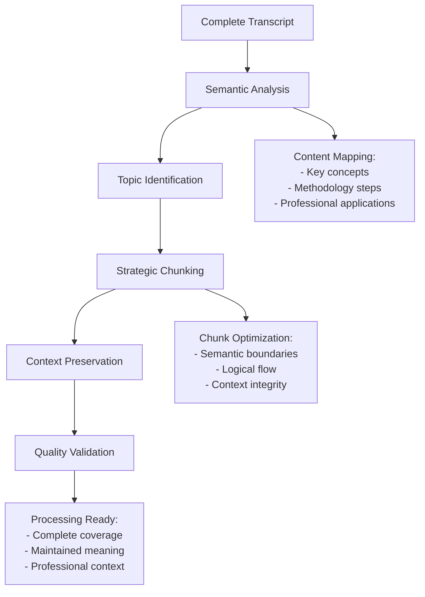
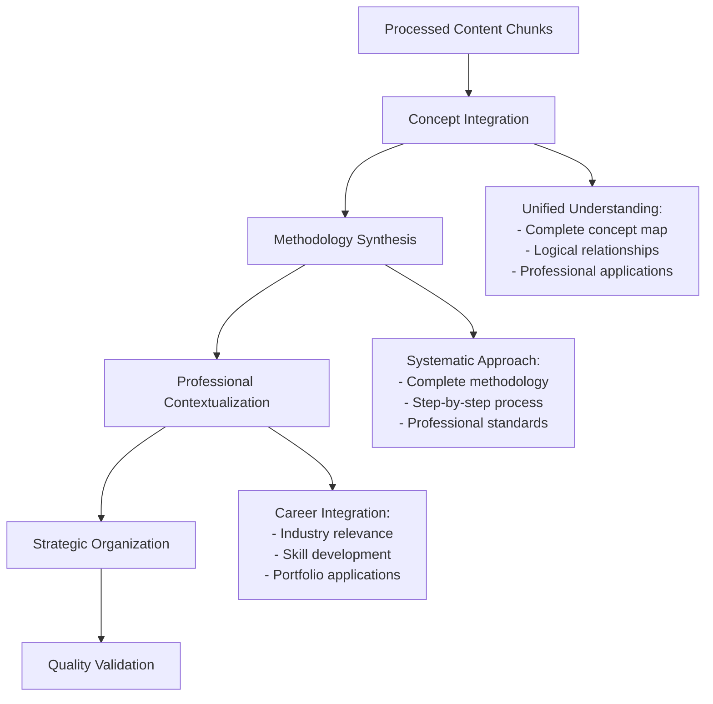

# Content Preservation Analysis

## Description
Comprehensive content analysis with strategic chunking for YouTube videos and other content, ensuring complete information preservation, systematic processing, and professional-grade content extraction that maintains context and meaning.

## User Message Template
**CONTENT PRESERVATION ANALYSIS WITH STRATEGIC PROCESSING**

Comprehensive content analysis with strategic chunking and complete information preservation:

**CONTENT TO ANALYZE:**
```
{{content}}
```

**EXISTING CONTENT:**
```
{{existing_content}}
```

**ANALYSIS DEPTH**: {{analysis_depth}}

## 🎯 **Comprehensive Content Processing Framework**

### 📋 **Phase 1: Content Analysis & Extraction**

> [!quote] **Complete Content Processing Protocol**
> Systematic analysis ensuring ALL valuable information is extracted, preserved, and strategically processed for comprehensive integration.

#### **YouTube Video Processing Protocol**

**Step 1: Complete Video Analysis**
> [!info] **Comprehensive Video Processing**
> Extract complete video information including metadata, transcript, and contextual elements

```yaml
# YouTube Processing Framework
youtube_analysis:
  video_metadata:
    - video_title: Extract professional title
    - channel_info: Creator expertise and authority
    - duration: Complete video length
    - publication_date: Content currency
    - description: Additional context
    - engagement_metrics: Professional validation
    
  content_extraction:
    - complete_transcript: 100% video content
    - timestamp_mapping: Time-based organization
    - speaker_identification: Authority attribution
    - visual_elements: Described content
    - supplementary_materials: Links and resources
```

**Step 2: Strategic Content Chunking**
> [!success] **Intelligent Content Segmentation**
> Break down lengthy content into manageable, semantically coherent chunks while preserving complete information



**Step 3: Comprehensive Content Preservation**
> [!example] **Complete Information Retention**
> Systematic preservation of ALL content elements with strategic organization

```yaml
# Content Preservation Protocol
preservation_framework:
  content_completeness:
    - full_transcript_capture: 100% coverage
    - contextual_preservation: Meaning retention
    - professional_context: Industry relevance
    - practical_applications: Real-world examples
    
  strategic_organization:
    - concept_hierarchy: Logical structure
    - methodology_sequence: Step-by-step processes
    - professional_applications: Career context
    - cross_references: Knowledge connections
    
  quality_assurance:
    - accuracy_verification: Content integrity
    - completeness_validation: Full coverage
    - context_maintenance: Meaning preservation
    - professional_standards: Industry compliance
```

### 📋 **Phase 2: Advanced Content Analysis**

#### **Systematic Content Processing**
> [!tip] **Professional Content Analysis Framework**
> Comprehensive analysis ensuring all valuable information is identified, categorized, and preserved

**Content Classification System:**
```yaml
# Advanced Content Classification
content_analysis:
  primary_concepts:
    - core_principles: Fundamental concepts
    - technical_methods: Implementation approaches
    - professional_applications: Industry use cases
    - best_practices: Industry standards
    
  supporting_elements:
    - examples: Practical demonstrations
    - case_studies: Real-world applications
    - troubleshooting: Problem-solving approaches
    - professional_insights: Expert commentary
    
  strategic_information:
    - career_development: Professional growth
    - industry_context: Market relevance
    - skill_building: Competency development
    - portfolio_applications: Professional showcase
```

**Professional Context Integration:**
> [!warning] **Critical Context Preservation**
> Maintain professional context and industry relevance throughout processing

| Content Type | Processing Strategy | Professional Context | Strategic Value |
|--------------|-------------------|---------------------|----------------|
| **Core Concepts** | Systematic extraction | Industry fundamentals | Foundation building |
| **Methodologies** | Step-by-step capture | Professional workflows | Skill development |
| **Examples** | Practical demonstration | Real-world application | Portfolio building |
| **Expert Insights** | Authority attribution | Professional credibility | Career advancement |

### 📋 **Phase 3: Strategic Content Synthesis**

#### **Comprehensive Information Integration**
> [!example] **Complete Content Synthesis**
> Systematic integration of all processed content into coherent, professional framework



#### **Professional Value Optimization**
> [!success] **Strategic Content Enhancement**
> Optimize processed content for maximum professional value and career development impact

```yaml
# Professional Value Framework
value_optimization:
  technical_depth:
    - comprehensive_coverage: Complete topic analysis
    - professional_accuracy: Industry-standard precision
    - practical_applicability: Real-world implementation
    - skill_development: Competency building
    
  career_relevance:
    - industry_applications: Professional use cases
    - portfolio_integration: Career showcase
    - skill_advancement: Professional growth
    - market_positioning: Industry recognition
    
  strategic_connections:
    - cross_domain_links: Interdisciplinary value
    - professional_networks: Career connections
    - knowledge_integration: Comprehensive understanding
    - advancement_pathways: Career development
```

### 📋 **Phase 4: Quality Assurance & Validation**

#### **Comprehensive Content Validation**
> [!quote] **Professional Quality Standards**
> Systematic validation ensuring complete content preservation and professional quality

**Content Completeness Validation:**
```yaml
# Quality Validation Framework
validation_protocol:
  content_integrity:
    - complete_coverage: 100% content captured
    - accuracy_verification: Information correctness
    - context_preservation: Meaning retention
    - professional_standards: Industry compliance
    
  processing_quality:
    - chunk_coherence: Logical segmentation
    - synthesis_accuracy: Correct integration
    - professional_context: Industry relevance
    - strategic_value: Career development impact
    
  output_standards:
    - publication_ready: Professional presentation
    - comprehensive_analysis: Complete understanding
    - strategic_integration: Knowledge networking
    - career_focused: Professional development
```

#### **Professional Output Preparation**
> [!info] **Publication-Ready Content Preparation**
> Prepare processed content for integration into publication-quality note structure

```yaml
# Output Preparation Framework
output_preparation:
  content_organization:
    - logical_structure: Professional presentation
    - comprehensive_coverage: Complete analysis
    - strategic_emphasis: Career development focus
    - professional_context: Industry relevance
    
  integration_readiness:
    - vault_compatibility: Obsidian optimization
    - cross_reference_potential: Knowledge networking
    - metadata_preparation: Professional classification
    - quality_standards: Publication readiness
```

### 📊 **Processing Success Metrics**

#### **Content Processing Validation**
> [!success] **Comprehensive Processing Success**
> Measurable outcomes ensuring complete content processing and professional quality

| Processing Metric | Success Standard | Professional Benchmark | Strategic Impact |
|------------------|------------------|----------------------|------------------|
| **Content Completeness** | 100% coverage | Complete analysis | Comprehensive understanding |
| **Processing Accuracy** | Expert-verified | Professional precision | Reliable information |
| **Professional Context** | Industry-standard | Professional relevance | Career development |
| **Strategic Value** | High-impact | Career advancement | Professional growth |

**PROCESSING OBJECTIVE**: Complete content analysis and preservation with strategic chunking, comprehensive information extraction, professional contextualization, and publication-ready preparation that ensures 100% content coverage and maximum strategic value for career development.
