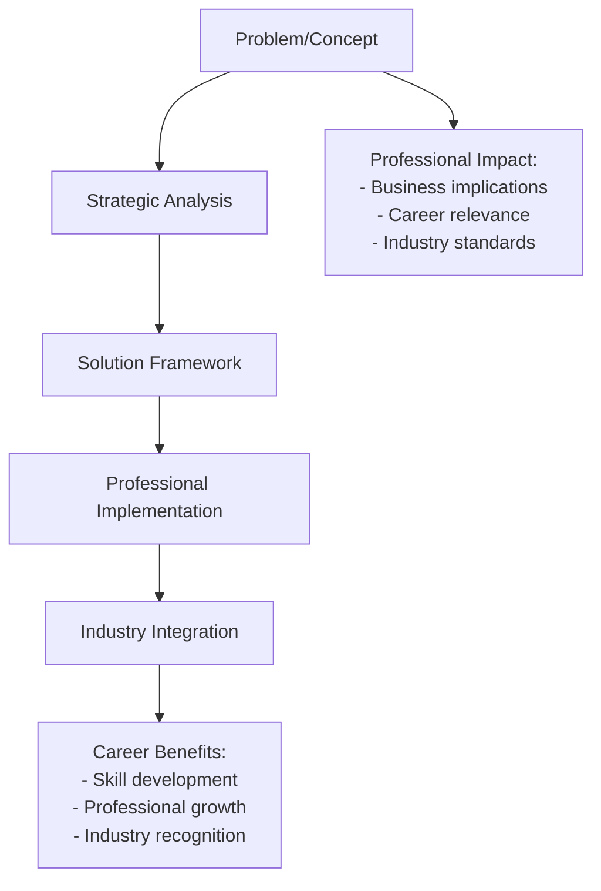
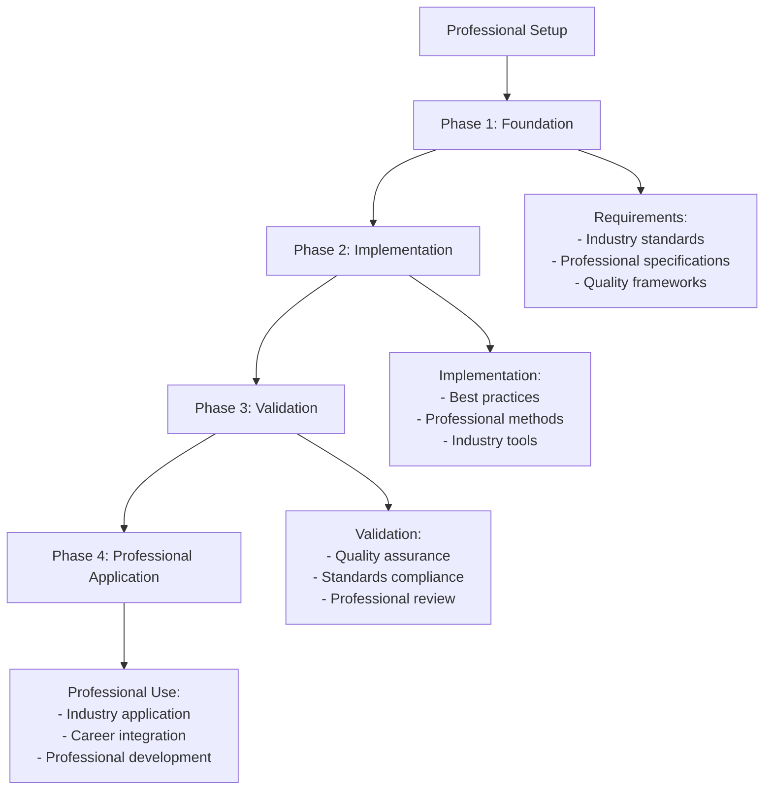
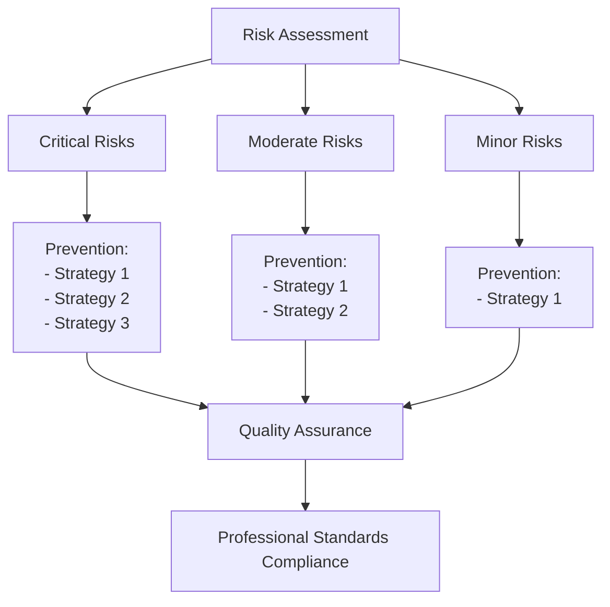
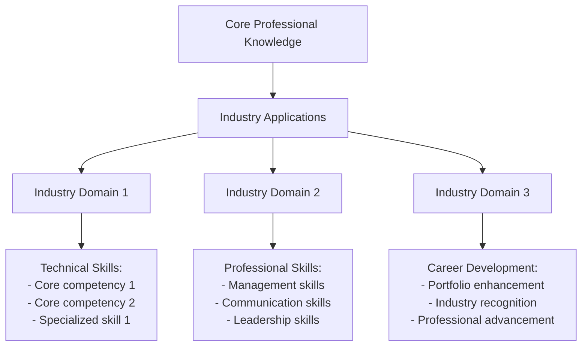

# Layered Note Structure Creator

## Description
Creates sophisticated, multi-layered note structures with comprehensive analysis, professional presentation, rich formatting, and strategic knowledge integration that rivals industry-standard technical documentation.

## User Message Template
**LAYERED NOTE STRUCTURE - PUBLICATION QUALITY**

Create sophisticated, multi-layered note structures with comprehensive professional presentation:

**ANALYZED CONTENT:**
```
{{analyzed_content}}
```

**VAULT CONTEXT:**
```
{{vault_context}}
```

**STRUCTURE TYPE**: {{structure_type}}

## 🎯 **Publication-Quality Note Architecture**

### 📋 **Professional Structure Framework**

> [!quote] **Industry-Standard Documentation Architecture**
> Create comprehensive, sophisticated note structures with multiple information layers, rich formatting, detailed analysis, and professional presentation that serves diverse professional use cases while maintaining technical depth.

#### **Multi-Layer Architecture Principles**

**Layer 1: Quick Reference & Overview**
- Professional summary with strategic context
- Key concepts with visual indicators
- Critical information for immediate access
- Professional validation framework

**Layer 2: Comprehensive Technical Content**
- Detailed analysis with professional context
- Implementation methodologies and workflows
- Technical specifications and industry standards
- Professional applications and use cases

**Layer 3: Advanced Professional Applications**
- Expert-level content and specialization
- Industry integration and career development
- Strategic knowledge connections
- Professional evaluation and assessment

**Layer 4: Extended Resources & Integration**
- Cross-domain professional connections
- Advanced learning resources
- Industry-standard educational materials
- Strategic knowledge network integration

#### **Professional Structure Template**
```markdown
# 🎯 Professional Title with Domain-Appropriate Emoji

*Professional subtitle with strategic context and industry relevance*

> [!abstract] **Comprehensive Professional Overview**
> Detailed summary with strategic context, professional applications, industry relevance, and career development implications

---

## 🎯 **Executive Summary & Strategic Framework**

### 🔍 **Core Problem/Concept Analysis**
> [!danger] **Critical Issue/Concept Definition**
> Comprehensive analysis with root cause identification, impact assessment, professional implications, and strategic context

### ⚡ **Solution/Implementation Framework**
> [!success] **Strategic Professional Approach**
> Detailed methodology with implementation strategy, validation methods, professional standards, and industry best practices



### 🎯 **Quick Reference Guide**
> [!quote] **Professional Standards Summary**
> Essential information for immediate professional application

| Component | Professional Standard | Industry Application | Career Impact |
|-----------|----------------------|-------------------|---------------|
| **Key Element 1** | Industry specification | Professional use case | Career benefit |
| **Key Element 2** | Industry specification | Professional use case | Career benefit |

---

## 🔬 **Technical Foundation & Professional Analysis**

### 🧠 **Core Principles & Methodology**
> [!info] **Essential Professional Knowledge**
> Comprehensive technical analysis with professional context, industry standards, and practical applications

| Component | Technical Specification | Professional Priority | Industry Standard |
|-----------|------------------------|---------------------|-------------------|
| **Element 1** | Detailed specification | 🟢 **Critical** - Foundation | ✅ Industry requirement |
| **Element 2** | Detailed specification | 🟡 **Important** - Enhancement | ⚠️ Recommended practice |
| **Element 3** | Detailed specification | 🔴 **Advanced** - Optimization | 🔬 Specialized knowledge |

### 🏗️ **Implementation Architecture & Workflow**
> [!example] **Professional Implementation Framework**
> Systematic approach with industry standards, quality validation, and professional best practices

#### **Professional Workflow Diagram**


---

## 🛠️ **Professional Methodology & Standards**

### 📏 **Systematic Professional Approach**
> [!quote] **Industry Standard Protocol**
> Comprehensive methodology with professional validation, quality assurance, and industry compliance

#### **Professional Method Comparison Matrix**
| Method | Effectiveness | Efficiency | Learning Curve | Professional Adoption | Industry Standard |
|--------|---------------|------------|---------------|---------------------|-------------------|
| **Method 1** | 🟢 Excellent | 🟢 High | 🟡 Moderate | 🟢 Industry standard | ✅ Recommended |
| **Method 2** | 🟡 Good | 🟡 Moderate | 🟢 Easy | 🟡 Alternative | ⚠️ Situational |
| **Method 3** | 🔴 Poor | 🟢 High | 🟢 Easy | 🔴 Deprecated | ❌ Avoid |

### 🎯 **Quality Assurance & Professional Standards**
> [!tip] **Professional Validation Framework**
> Comprehensive quality control with measurable outcomes and industry benchmarks

---

## ⚠️ **Risk Management & Error Prevention**

### 🚨 **Professional Risk Analysis**
> [!danger] **Critical Risk Factors & Mitigation**
> Systematic analysis of professional risks with prevention strategies and recovery methods

| Risk Type | Probability | Impact | Mitigation Strategy | Professional Consequence |
|-----------|-------------|--------|-------------------|------------------------|
| **Critical Risk 1** | 🔴 High | 🔴 High | Detailed prevention | Severe business impact |
| **Moderate Risk 2** | 🟡 Medium | 🟡 Medium | Prevention method | Moderate business impact |
| **Minor Risk 3** | 🟢 Low | 🟢 Low | Prevention method | Minor business impact |

### 🎨 **Risk Prevention Framework**


---

## 🎯 **Professional Applications & Industry Integration**

### 🎭 **Industry Use Cases & Professional Context**
> [!success] **Professional Implementation Standards**
> Comprehensive analysis of industry applications with career development implications

| Industry Domain | Technical Requirements | Professional Skills | Career Advancement |
|----------------|----------------------|-------------------|-------------------|
| **Industry 1** | Technical specification | Required competencies | Career pathway |
| **Industry 2** | Technical specification | Required competencies | Career pathway |
| **Industry 3** | Technical specification | Required competencies | Career pathway |

### 🎨 **Cross-Domain Professional Integration**
> [!example] **Multi-Industry Application Framework**
> Strategic understanding of professional applications across multiple domains



---

## 📈 **Professional Development & Skill Progression**

### 🎯 **Strategic Career Development Framework**
> [!info] **Professional Growth Timeline**
> Systematic skill building with measurable outcomes, industry benchmarks, and career advancement milestones

#### **Professional Development Phases**

**Phase 1: Foundation Building (Timeline: X months)**
> [!tip] **Entry-Level Professional Competency**
> Essential skills for professional entry and career foundation

| Skill | Practice Method | Success Metric | Industry Benchmark |
|-------|----------------|---------------|-------------------|
| **Core Skill 1** | Specific practice approach | Measurable outcome | Industry standard |
| **Core Skill 2** | Specific practice approach | Measurable outcome | Industry standard |

**Phase 2: Professional Development (Timeline: X months)**
> [!tip] **Mid-Level Professional Competency**
> Advanced skills for professional competency and career advancement

**Phase 3: Expert Specialization (Timeline: X months)**
> [!success] **Senior-Level Professional Mastery**
> Expert-level skills for industry leadership and specialization

---

## 📊 **Technical Specifications & Quality Validation**

### 🎯 **Professional Quality Assurance Framework**
> [!quote] **Industry Standards Verification**
> Comprehensive quality validation with measurable professional standards

| Component | Professional Requirement | Validation Method | Industry Standard |
|-----------|-------------------------|------------------|-------------------|
| **Quality Aspect 1** | ✅ Specific requirement | Measurement method | Industry expectation |
| **Quality Aspect 2** | ✅ Specific requirement | Measurement method | Industry expectation |

### 📐 **Professional Standards Comparison Matrix**
| Aspect | Entry Level | Professional Level | Expert Level | Industry Leading |
|--------|-------------|-------------------|--------------|------------------|
| **Technical Competency** | 🟡 Adequate | 🟢 Excellent | 🟢 Superior | 🟢 Industry benchmark |
| **Professional Presentation** | 🟡 Adequate | 🟢 Excellent | 🟢 Superior | 🟢 Industry benchmark |

---

## 🔗 **Strategic Knowledge Network Integration**

### 🎨 **Foundation Knowledge Connections**
> [!note] **Essential Cross-References**
> Strategic connections that enhance professional understanding and career development

### 🔬 **Technical Knowledge Integration**
> [!info] **Advanced Technical Concepts**
> Deep technical knowledge connections for professional mastery

### 🚀 **Professional Development Pathways**
> [!tip] **Career Integration Points**
> Strategic professional development connections and career advancement opportunities

---

## 🎓 **Professional Evaluation & Assessment**

### 💼 **Industry Assessment Criteria**
> [!warning] **Professional Standards Evaluation**
> How knowledge and skills are evaluated in professional contexts

---

## 📚 **Extended Professional Resources**

### 🎥 **Source Material Analysis**
> [!info] **Original Content Reference**
> Professional attribution and contextual analysis

### 📖 **Professional Development Resources**
> [!tip] **Industry-Standard Educational Materials**
> Advanced learning resources for continued professional growth

---

## Related Notes
- [[Strategic Connection 1]]
- [[Strategic Connection 2]]
```

### 📊 **Structure Quality Standards**

> [!error] **Critical Architecture Requirements**
> - **Multi-Layer Information**: Serves quick reference, comprehensive study, and professional application
> - **Rich Content**: Every section provides substantial professional value
> - **Professional Analysis**: Deep technical understanding with practical applications
> - **Visual Elements**: Comprehensive tables, diagrams, and professional presentation
> - **Strategic Integration**: Connected to broader professional knowledge network
> - **Industry Standards**: Professional presentation and technical depth throughout
> - **Career Focus**: Clear connections to professional development and industry applications

**ARCHITECTURE OBJECTIVE**: Create sophisticated, multi-layered note structures that serve diverse professional use cases while maintaining comprehensive technical depth, strategic knowledge integration, and publication-quality presentation standards.
