# Note Quality Assurance

## Description
Comprehensive quality assurance for professional-grade note content, ensuring publication-ready standards, technical accuracy, professional presentation, and strategic value that rivals industry documentation and educational resources.

## User Message Template
**NOTE QUALITY ASSURANCE - PROFESSIONAL STANDARDS**

Comprehensive quality assurance evaluation for professional-grade note content:

**NOTE CONTENT:**
```
{{note_content}}
```

**ORIGINAL SOURCE:**
```
{{original_source}}
```

**QUALITY STANDARDS**: {{quality_standards}}

## 🎯 **Professional Quality Assurance Framework**

### 📋 **Comprehensive Quality Standards Protocol**

> [!quote] **Publication-Ready Quality Validation**
> Systematic evaluation ensuring professional-grade content quality, technical accuracy, presentation standards, and strategic value that rivals industry documentation and educational resources.

#### **Quality Assessment Matrix**

**Core Quality Dimensions:**
> [!info] **Professional Quality Framework**
> Comprehensive evaluation across multiple professional quality dimensions

| Quality Dimension | Professional Standard | Assessment Criteria | Industry Benchmark |
|-------------------|---------------------|-------------------|-------------------|
| **Technical Accuracy** | Expert-verified content | Factual correctness, methodology validation | Industry expert review |
| **Professional Presentation** | Publication-ready format | Visual hierarchy, formatting standards | Professional documentation |
| **Content Depth** | Comprehensive coverage | Thorough analysis, practical application | Educational resource quality |
| **Strategic Value** | Career development impact | Professional relevance, skill advancement | Industry training standards |

### 🔍 **Content Quality Validation**

#### **Technical Accuracy Assessment**
> [!success] **Professional Technical Standards**
> Comprehensive evaluation of technical content accuracy and professional validity

```yaml
# Technical Accuracy Framework
technical_validation:
  factual_accuracy:
    - methodology_correctness: verified
    - technical_specifications: industry_standard
    - professional_practices: current
    - industry_standards: compliant
    
  source_credibility:
    - author_expertise: professional_expert
    - source_authority: industry_recognized
    - publication_standards: peer_reviewed
    - currency_status: current
    
  professional_application:
    - practical_validity: field_tested
    - industry_adoption: widespread
    - professional_outcomes: measurable
    - career_relevance: high
```

#### **Professional Presentation Evaluation**
> [!example] **Publication-Ready Presentation Standards**
> Systematic evaluation of professional presentation quality

```mermaid
graph TD
    A[Presentation Quality] --> B[Visual Hierarchy]
    A --> C[Content Structure]
    A --> D[Professional Formatting]
    
    B --> B1[Emoji Headers: ✅]
    B --> B2[Typography: ✅]
    B --> B3[Visual Flow: ✅]
    
    C --> C1[Logical Organization: ✅]
    C --> C2[Progressive Complexity: ✅]
    C --> C3[Clear Transitions: ✅]
    
    D --> D1[Callouts: ✅]
    D --> D2[Tables: ✅]
    D --> D3[Diagrams: ✅]
```



### 📊 **Advanced Quality Metrics**

#### **Content Depth Analysis**
> [!tip] **Comprehensive Content Evaluation**
> Detailed assessment of content depth and professional comprehensiveness

| Content Aspect | Quality Level | Professional Standard | Industry Comparison |
|----------------|---------------|---------------------|-------------------|
| **Conceptual Coverage** | 🟢 Comprehensive | Complete topic coverage | Industry training material |
| **Practical Application** | 🟢 Extensive | Real-world implementation | Professional workflow |
| **Professional Context** | 🟢 Expert-level | Industry-relevant examples | Professional case studies |
| **Learning Progression** | 🟢 Systematic | Structured skill building | Educational curriculum |

#### **Strategic Value Assessment**
> [!warning] **Professional Impact Evaluation**
> Systematic assessment of strategic professional value and career development impact

```yaml
# Strategic Value Framework
strategic_assessment:
  professional_relevance:
    - career_applicability: high
    - skill_development: measurable
    - portfolio_impact: significant
    - industry_demand: growing
    
  learning_effectiveness:
    - comprehension_support: excellent
    - practical_application: clear
    - skill_transfer: effective
    - retention_optimization: high
    
  career_development:
    - advancement_potential: significant
    - competency_building: comprehensive
    - professional_recognition: enhanced
    - industry_positioning: improved
```

### 🛠️ **Quality Improvement Framework**

#### **Content Enhancement Protocol**
> [!success] **Professional Improvement Standards**
> Systematic approach to content enhancement and quality optimization


#### **Professional Standards Compliance**
> [!quote] **Industry Standard Validation**
> Comprehensive compliance assessment with professional industry standards

| Standard Category | Compliance Level | Professional Requirement | Industry Benchmark |
|-------------------|------------------|------------------------|-------------------|
| **Technical Standards** | ✅ Fully Compliant | Industry methodology | Professional practice |
| **Presentation Standards** | ✅ Fully Compliant | Publication quality | Professional documentation |
| **Educational Standards** | ✅ Fully Compliant | Learning effectiveness | Training curriculum |
| **Professional Standards** | ✅ Fully Compliant | Career development | Industry certification |

### ⚠️ **Quality Risk Assessment**

#### **Content Risk Analysis**
> [!danger] **Professional Risk Evaluation**
> Systematic identification and mitigation of content quality risks

| Risk Category | Risk Level | Impact Assessment | Mitigation Strategy |
|---------------|------------|------------------|-------------------|
| **Technical Inaccuracy** | 🟢 Low | Minimal professional impact | Expert review validation |
| **Presentation Issues** | 🟢 Low | Minor usability impact | Format standardization |
| **Content Gaps** | 🟡 Medium | Moderate learning impact | Content expansion |
| **Strategic Misalignment** | 🟢 Low | Minor career impact | Strategic optimization |

#### **Quality Assurance Checklist**
> [!example] **Professional Quality Validation**
> Comprehensive checklist for professional quality assurance

```yaml
# Quality Assurance Checklist
quality_checklist:
  technical_accuracy:
    - methodology_validation: ✅
    - technical_correctness: ✅
    - professional_standards: ✅
    - industry_alignment: ✅
    
  presentation_quality:
    - visual_hierarchy: ✅
    - formatting_standards: ✅
    - professional_appearance: ✅
    - accessibility_compliance: ✅
    
  content_comprehensiveness:
    - topic_coverage: ✅
    - practical_examples: ✅
    - professional_context: ✅
    - learning_progression: ✅
    
  strategic_value:
    - career_relevance: ✅
    - skill_development: ✅
    - professional_impact: ✅
    - industry_currency: ✅
```

### 📈 **Quality Improvement Recommendations**

#### **Enhancement Opportunities**
> [!tip] **Professional Development Opportunities**
> Strategic recommendations for content enhancement and quality improvement

```yaml
# Enhancement Recommendations
improvement_recommendations:
  immediate_enhancements:
    - technical_validation: expert_review
    - presentation_polish: format_standardization
    - content_expansion: practical_examples
    
  strategic_improvements:
    - professional_integration: industry_alignment
    - career_development: skill_pathway
    - cross_domain_connections: knowledge_network
    
  long_term_optimization:
    - industry_currency: regular_updates
    - professional_standards: continuous_improvement
    - strategic_positioning: career_advancement
```

### 🎯 **Quality Validation Outcomes**

#### **Professional Quality Certification**
> [!success] **Quality Assurance Results**
> Comprehensive quality validation outcomes and professional certification

| Quality Metric | Achievement Level | Professional Standard | Industry Recognition |
|----------------|------------------|---------------------|-------------------|
| **Technical Accuracy** | 🟢 Excellent | Expert-level precision | Industry authority |
| **Professional Presentation** | 🟢 Excellent | Publication-ready quality | Professional documentation |
| **Content Depth** | 🟢 Excellent | Comprehensive coverage | Educational resource |
| **Strategic Value** | 🟢 Excellent | High career impact | Professional development |

#### **Quality Assurance Summary**
> [!quote] **Professional Quality Validation**
> Comprehensive summary of quality assurance evaluation and professional standards compliance

```yaml
# Quality Assurance Summary
quality_summary:
  overall_quality_score: 9.5/10
  professional_readiness: publication_ready
  technical_accuracy: expert_verified
  presentation_quality: professional_standard
  content_depth: comprehensive
  strategic_value: high_impact
  
# Professional Certification
certification_status:
  quality_standard: industry_professional
  technical_validation: expert_approved
  presentation_compliance: publication_ready
  educational_effectiveness: proven
  career_development_impact: significant
```

**QUALITY ASSURANCE OBJECTIVE**: Ensure comprehensive professional quality standards that deliver publication-ready content with expert-level technical accuracy, professional presentation, comprehensive depth, and significant strategic value for career development and industry recognition.
