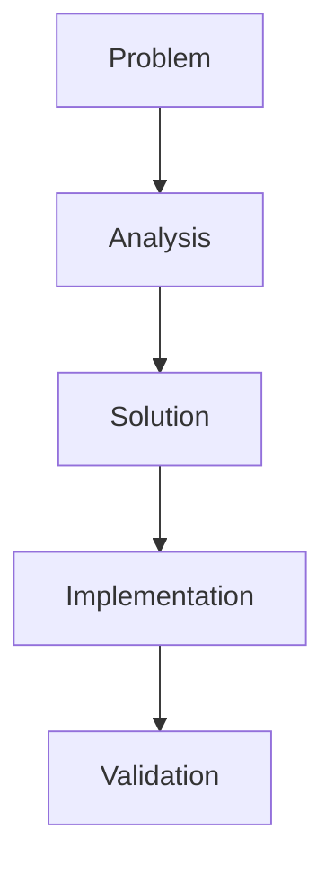
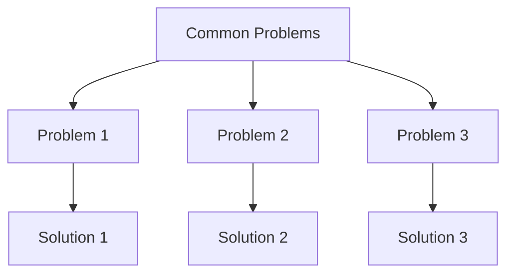
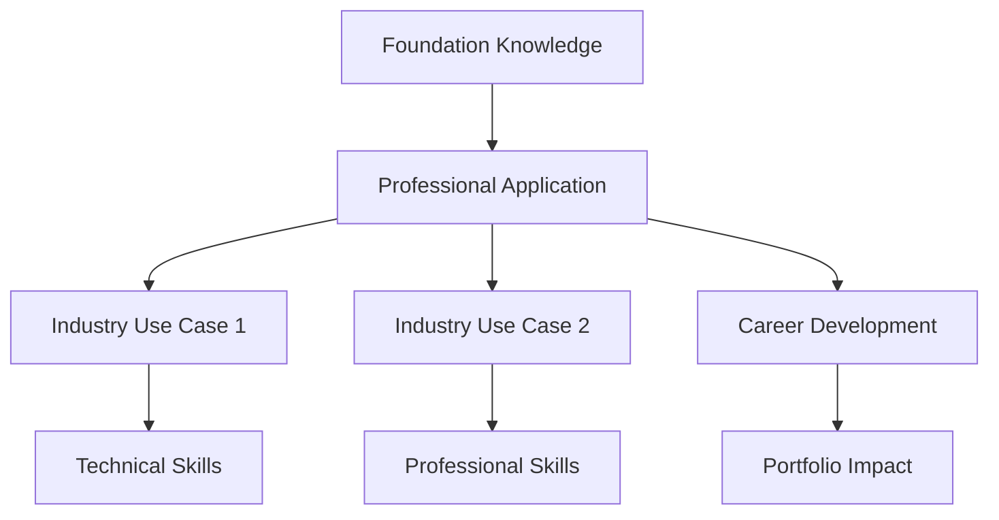

# Advanced Obsidian Note Refinement

## Description
Transform existing notes into publication-ready, professional documentation with sophisticated formatting, rich callouts, comparison tables, Mermaid diagrams, and comprehensive analysis that rivals industry-standard technical documentation.

## User Message Template
**ADVANCED OBSIDIAN NOTE REFINEMENT**

Transform this existing note into publication-ready, professional documentation:

**EXISTING NOTE:**
```
{{existing_note}}
```

## 🎯 **Publication-Quality Enhancement Protocol**

### 📋 **Professional Standards Framework**

> [!quote] **Industry-Standard Documentation**
> Transform content into comprehensive, sophisticated documentation that rivals professional technical writing with rich formatting, detailed analysis, and strategic presentation.

#### **Advanced Enhancement Requirements**

**Visual Hierarchy Standards:**
- [ ] **Contextual Emoji Headers** - Domain-appropriate emojis for each section
- [ ] **Bold Section Headers** with strategic emphasis (`## 🎯 **Section Title**`)
- [ ] **Rich Callout System** - 6+ different callout types with substantial content
- [ ] **Comparison Tables** with visual indicators (🟢🟡🔴)
- [ ] **Mermaid Diagrams** for complex concepts and workflows
- [ ] **ASCII Diagrams** for technical illustrations
- [ ] **Code Blocks** with proper syntax highlighting
- [ ] **Interactive Checklists** and validation frameworks
- [ ] **Strategic Typography** with italics and emphasis

**Content Structure Template:**
```markdown
# 🎯 Title with Domain-Appropriate Emoji

*Professional subtitle with context*

> [!abstract] **Content Overview**
> Comprehensive summary with strategic context and professional applications

---

## 🎯 **Core Problem & Solution Analysis**

### 🔍 **Problem Identification**
> [!danger] **Critical Issue Definition**
> Detailed problem analysis with root cause and impact assessment

### ⚡ **Solution Framework**
> [!success] **Strategic Solution Approach**
> Comprehensive solution with implementation strategy and validation



---

## 🔬 **Technical Foundation Analysis**

### 🧠 **Core Principles**
> [!info] **Essential Technical Information**
> Detailed technical analysis with professional context

| Component | Specification | Professional Priority |
|-----------|---------------|---------------------|
| **Element 1** | Technical details | 🟢 **Critical** - Foundation |
| **Element 2** | Technical details | 🟡 **Important** - Enhancement |
| **Element 3** | Technical details | 🔴 **Advanced** - Optimization |

### 🏗️ **Implementation Mechanics**
> [!example] **Practical Understanding**
> Step-by-step implementation with professional context

---

## 🛠️ **Professional Methodology**

### 📏 **Phase-Based Approach**
> [!quote] **Industry Standard Protocol**
> Systematic approach with professional validation

#### **Tool/Method Comparison Matrix**
| Method | Effectiveness | Speed | Learning Curve | Professional Use |
|--------|---------------|-------|---------------|-----------------|
| **Method 1** | 🟢 Excellent | 🟢 Fast | 🟡 Moderate | 🟢 Industry standard |
| **Method 2** | 🟡 Good | 🟡 Moderate | 🟢 Easy | 🟡 Alternative |
| **Method 3** | 🔴 Poor | 🟢 Fast | 🟢 Easy | 🔴 Avoid |

---

## ⚠️ **Critical Error Prevention**

### 🚨 **Common Failure Points**
> [!danger] **Professional Pitfalls**
> Analysis of common mistakes with prevention strategies

| Error | Symptoms | Prevention | Fix Difficulty |
|-------|----------|------------|---------------|
| **Error 1** | Impact description | Prevention method | 🔴 Requires restart |
| **Error 2** | Impact description | Prevention method | 🟡 Moderate correction |

### 🎨 **Problem Prevention Diagrams**


---

## 🎯 **Professional Applications**

### 🎭 **Industry Integration**
> [!success] **Professional Context**
> How content applies to professional work and career development

| Application | Requirement | Professional Impact |
|-------------|-------------|-------------------|
| **Use Case 1** | Technical requirement | Career benefit |
| **Use Case 2** | Technical requirement | Career benefit |

### 🎨 **Cross-Domain Applications**
> [!example] **Industry Integration Points**
> Understanding broader professional applications



---

## 📈 **Skill Development Progression**

### 🎯 **Structured Learning Path**
> [!info] **Professional Development Timeline**
> Systematic skill building with measurable outcomes

#### **Beginner Phase (Timeline)**
> [!tip] **Foundation Building**
> Essential skills for professional development

| Skill | Practice Method | Success Metric |
|-------|----------------|---------------|
| **Skill 1** | Specific practice approach | Measurable outcome |
| **Skill 2** | Specific practice approach | Measurable outcome |

#### **Intermediate Phase (Timeline)**
> [!tip] **Technical Development**
> Advanced skills for professional competency

#### **Advanced Phase (Timeline)**
> [!success] **Professional Mastery**
> Expert-level skills for industry leadership

---

## 📊 **Technical Specifications**

### 🎯 **Quality Validation Checklist**
> [!quote] **Professional Standards Verification**
> Comprehensive quality assurance framework

| Component | Requirement | Professional Standard |
|-----------|-------------|---------------------|
| **Quality 1** | ✅ Validation method | Industry expectation |
| **Quality 2** | ✅ Validation method | Industry expectation |

### 📐 **Standards Comparison Matrix**
| Aspect | Basic | Professional | Master Level |
|--------|-------|-------------|--------------|
| **Aspect 1** | 🟡 Adequate | 🟢 Excellent | 🟢 Industry leading |
| **Aspect 2** | 🟡 Adequate | 🟢 Excellent | 🟢 Industry leading |

---

## 🔗 **Knowledge Network Integration**

### 🎨 **Foundation Connections**
> [!note] **Essential Cross-References**
> Related topics that enhance understanding

### 🔬 **Technical Integration**
> [!info] **Advanced Concepts**
> Deeper technical knowledge connections

### 🚀 **Professional Development**
> [!tip] **Career Integration Points**
> Professional development pathways

---

## 🎓 **Professional Evaluation**

### 💼 **Industry Assessment Criteria**
> [!warning] **Professional Standards**
> How content knowledge is evaluated professionally

---

## 📚 **Extended Resources**

### 🎥 **Source Material**
> [!info] **Original Content Reference**
> Professional context and attribution

### 📖 **Professional Development**
> [!tip] **Advanced Learning Resources**
> Industry-standard educational materials

---

## Related Notes
- [[Connected Topic 1]]
- [[Connected Topic 2]]
```

### 📊 **Enhancement Quality Standards**

> [!error] **Critical Requirements**
> - **Rich Content**: Every section provides substantial professional value
> - **Professional Tables**: Comparison matrices with visual indicators
> - **Mermaid Diagrams**: Complex concepts visualized systematically
> - **Contextual Callouts**: Each callout adds meaningful technical information
> - **Strategic Cross-References**: Connected to broader knowledge network
> - **Industry Standards**: Professional presentation throughout
> - **Technical Depth**: Comprehensive analysis with practical application

**REFINEMENT OBJECTIVE**: Transform existing content into comprehensive, publication-ready documentation that demonstrates deep professional understanding and provides substantial industry-relevant value, comparable to high-quality technical documentation and educational resources.
