# Vault Integration Optimizer

## Description
Creates comprehensive strategic integration between new notes and existing vault ecosystem, establishing sophisticated knowledge networks, professional cross-references, and industry-standard connections that enhance discoverability and career development value.

## User Message Template
**VAULT INTEGRATION OPTIMIZER - STRATEGIC NETWORKING**

Create comprehensive strategic integration between new content and existing vault ecosystem:

**NOTE CONTENT:**
```
{{note_content}}
```

**VAULT STRUCTURE:**
```
{{vault_structure}}
```

**INTEGRATION LEVEL**: {{integration_level}}

## 🎯 **Strategic Vault Integration Framework**

### 📋 **Comprehensive Integration Protocol**

> [!quote] **Professional Knowledge Network Architecture**
> Create sophisticated, strategic integration that establishes comprehensive knowledge networks, professional cross-references, and industry-standard connections that enhance discoverability, learning progression, and career development value.

#### **Integration Analysis Framework**

**Phase 1: Strategic Relationship Mapping**
> [!info] **Knowledge Network Analysis**
> Systematic analysis of existing vault content to identify strategic integration opportunities

```mermaid
graph TD
    A[New Content] --> B[Vault Analysis]
    B --> C[Strategic Mapping]
    C --> D[Integration Planning]
    D --> E[Implementation]
    
    B --> F[Existing Notes Analysis]
    B --> G[MOC Integration Points]
    B --> H[Cross-Domain Opportunities]
    
    C --> I[Direct Relationships]
    C --> J[Conceptual Bridges]
    C --> K[Professional Pathways]
    
    D --> L[Bidirectional Linking]
    D --> M[MOC Updates]
    D --> N[Cross-References]
```



**Phase 2: Professional Connection Strategy**
> [!success] **Industry-Standard Integration**
> Establish professional-grade connections that support career development and knowledge advancement

| Integration Type | Professional Value | Implementation Strategy | Career Impact |
|------------------|-------------------|------------------------|---------------|
| **Foundation Connections** | Core knowledge building | Link to fundamental concepts | Skill development |
| **Applied Connections** | Practical application | Connect to implementation examples | Portfolio building |
| **Advanced Connections** | Expert-level integration | Link to specialized knowledge | Career advancement |
| **Cross-Domain Bridges** | Interdisciplinary value | Connect across knowledge areas | Versatility enhancement |

### 🔗 **Strategic Cross-Reference Architecture**

#### **Direct Relationship Integration**
> [!example] **Immediate Knowledge Connections**
> Establish direct, high-value connections to existing content

```yaml
# Direct Integration Mapping
direct_connections:
  prerequisite_knowledge:
    - note: "Foundation Note"
      relationship: "builds_upon"
      integration_point: "Core Concepts section"
      bidirectional: true
      
  complementary_content:
    - note: "Related Technique"
      relationship: "complements"
      integration_point: "Advanced Applications"
      bidirectional: true
      
  advanced_applications:
    - note: "Expert Implementation"
      relationship: "enables"
      integration_point: "Professional Development"
      bidirectional: true
```

#### **Conceptual Bridge Integration**
> [!tip] **Cross-Domain Professional Connections**
> Create strategic bridges between knowledge domains for comprehensive understanding

```yaml
# Conceptual Bridge Mapping
conceptual_bridges:
  creative_technical_bridge:
    - source_domain: "Art/Character Design"
      target_domain: "Computer Graphics/3D Modeling"
      bridge_concept: "Form and Structure Understanding"
      professional_value: "Technical Artist Development"
      
  technical_business_bridge:
    - source_domain: "Computer Science/Systems Design"
      target_domain: "Business/Project Management"
      bridge_concept: "Scalability and Resource Planning"
      professional_value: "Technical Leadership"
```

### 📊 **MOC Integration Strategy**

#### **Primary MOC Updates**
> [!warning] **Critical MOC Integration Requirements**
> Systematic updates to Maps of Content for comprehensive integration

```yaml
# MOC Integration Framework
moc_updates:
  primary_moc:
    file: "Art Foundation.md"
    section: "Key Concepts"
    integration_method: "descriptive_link"
    content_addition: "[[New Note]] - Professional technique description"
    
  secondary_mocs:
    - file: "Art.md"
      section: "Cross-Domain Integration"
      integration_method: "strategic_reference"
      content_addition: "Technical application connection"
      
  tertiary_mocs:
    - file: "Portfolio.md"
      section: "Professional Development"
      integration_method: "career_connection"
      content_addition: "Portfolio building application"
```

#### **Bidirectional Integration Protocol**
> [!success] **Strategic Two-Way Connection System**
> Ensure all connections enhance both source and target content


### 🎯 **Professional Development Integration**

#### **Career Pathway Connections**
> [!info] **Professional Growth Integration**
> Strategic connections that support career development and skill advancement

| Career Stage | Integration Strategy | Professional Benefit | Implementation |
|--------------|---------------------|---------------------|----------------|
| **Entry Level** | Foundation building connections | Skill development | Link to fundamental concepts |
| **Mid Level** | Applied skill connections | Portfolio building | Connect to implementation examples |
| **Senior Level** | Advanced technique connections | Specialization | Link to expert-level content |
| **Leadership** | Strategic knowledge connections | Industry expertise | Connect to business applications |

#### **Skill Transfer Integration**
> [!example] **Cross-Domain Skill Development**
> Strategic connections that demonstrate skill transferability

```yaml
# Skill Transfer Mapping
skill_transfers:
  technical_to_creative:
    - source_skill: "Systems thinking"
      target_application: "Visual composition"
      integration_note: "Design Systems"
      professional_value: "Technical Artist capability"
      
  creative_to_technical:
    - source_skill: "Visual hierarchy"
      target_application: "User interface design"
      integration_note: "UI/UX Principles"
      professional_value: "Design-developer collaboration"
```

### 🔍 **Advanced Integration Techniques**

#### **Semantic Integration Network**
> [!tip] **Intelligent Content Relationships**
> Advanced relationship mapping based on semantic analysis

```yaml
# Semantic Integration Framework
semantic_relationships:
  conceptual_similarity:
    - related_concept: "Form and structure"
      similarity_score: 0.85
      integration_notes: ["Anatomy", "3D Modeling", "Character Design"]
      
  methodological_alignment:
    - related_method: "Systematic approach"
      alignment_score: 0.90
      integration_notes: ["Project Management", "Software Development", "Art Fundamentals"]
      
  professional_relevance:
    - career_application: "Technical Artist"
      relevance_score: 0.95
      integration_notes: ["Computer Graphics", "Art Fundamentals", "Portfolio Development"]
```

#### **Progressive Learning Integration**
> [!success] **Skill Development Pathway**
> Strategic integration that supports systematic skill advancement


### 🎨 **Cross-Domain Integration Matrix**

#### **Creative-Technical Integration**
> [!example] **Interdisciplinary Professional Connections**
> Strategic bridges between creative and technical domains

| Creative Domain | Technical Domain | Integration Point | Professional Value |
|-----------------|------------------|-------------------|-------------------|
| **Art/Character Design** | **Computer Graphics** | Form understanding | Technical Artist |
| **Cinematography** | **Computer Science** | Visual systems | Technical Director |
| **Fashion Design** | **Business Strategy** | Design thinking | Creative Director |

#### **Academic-Professional Integration**
> [!info] **Theory-Practice Connection Strategy**
> Bridge academic knowledge with professional application

```yaml
# Academic-Professional Bridge
integration_bridges:
  theoretical_foundation:
    - academic_source: "Design Theory"
      professional_application: "User Experience Design"
      integration_value: "Evidence-based design decisions"
      
  practical_methodology:
    - academic_source: "Systems Analysis"
      professional_application: "Software Architecture"
      integration_value: "Systematic problem solving"
```

### 📈 **Integration Quality Metrics**

#### **Professional Integration Assessment**
> [!quote] **Strategic Integration Validation**
> Comprehensive assessment of integration quality and professional value

| Integration Aspect | Quality Standard | Professional Benchmark | Career Impact |
|-------------------|------------------|----------------------|---------------|
| **Connection Relevance** | High strategic value | Industry standard | Significant skill development |
| **Bidirectional Value** | Mutual enhancement | Professional practice | Enhanced knowledge network |
| **Career Alignment** | Clear professional path | Industry requirements | Measurable advancement |
| **Knowledge Depth** | Comprehensive coverage | Expert-level content | Professional competency |

#### **Integration Success Metrics**
> [!success] **Professional Integration Outcomes**
> Measurable outcomes that demonstrate successful vault integration

```yaml
# Success Metrics Framework
integration_success:
  discoverability_score: 9/10
  learning_pathway_clarity: excellent
  professional_relevance: high
  career_development_impact: significant
  knowledge_network_strength: comprehensive
  
# Professional Value Indicators
professional_indicators:
  skill_advancement: measurable
  portfolio_enhancement: significant
  career_opportunities: expanded
  industry_recognition: improved
  knowledge_authority: established
```

**INTEGRATION OBJECTIVE**: Create comprehensive, strategic integration that establishes sophisticated knowledge networks, enhances professional discoverability, supports systematic skill development, and maximizes career development value through intelligent relationship mapping and cross-domain connections.
